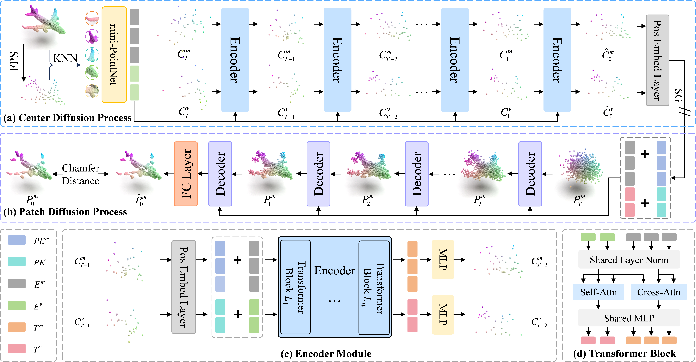

# Point-MaDi (NeurIPS 2025 Poster)

> [**Point-MaDi: Masked Autoencoding with Diffusion for Point Cloud Pre-training**](https://arxiv.org/abs/2302.02318) **NeurIPS 2025 Poster** <br>
> [Xiaoyang Xiao](https://scholar.google.com/citations?user=ABerR7kAAAAJ), [Runzhao Yao](https://scholar.google.com/citations?user=udCF7q4AAAAJ), [Zhiqiang Tian](https://scholar.google.com/citations?user=-LfcX9IAAAAJ), and [Shaoyi Du](https://scholar.google.com/citations?user=r2bk4sQAAAAJ)

[OpenReview](https://openreview.net/pdf?id=sYeE1obXGG)

This repository contains the code release of **Point-MaDi: Masked Autoencoding with Diffusion for Point Cloud Pre-training** (NeurIPS 2025 Poster)

## Point-MaDi

[//]: # (Mainstream 3D representation learning approaches are built upon contrastive or generative modeling pretext tasks, where great improvements in performance on various downstream tasks have been achieved. However, by investigating the methods of these two paradigms, we find that &#40;i&#41; contrastive models are data-hungry that suffer from a representation over-fitting issue; &#40;ii&#41; generative models have a data filling issue that shows inferior data scaling capacity compared to contrastive models. This motivates us to learn 3D representations by sharing the merits of both paradigms, which is non-trivial due to the pattern difference between the two paradigms. In this paper, we propose *contrast with reconstruct* &#40;**ReCon**&#41; that unifies these two paradigms. ReCon is trained to learn from both generative modeling teachers and cross-modal contrastive teachers through ensemble distillation, where the generative student is used to guide the contrastive student. An encoder-decoder style ReCon-block is proposed that transfers knowledge through cross attention with stop-gradient, which avoids pretraining over-fitting and pattern difference issues. ReCon achieves a new state-of-the-art in 3D representation learning, e.g., 91.26% accuracy on ScanObjectNN.)




## Introduction
In this work, we propose Point-MaDi, a novel Point cloud Masked autoencoding Diffusion framework for pre-training that integrates a dual-diffusion pretext task into an MAE architecture.


## 1. Requirements
PyTorch >= 1.7.0;
python >= 3.7;
CUDA >= 9.0;
GCC >= 4.9;
torchvision;

```
# Quick Start
conda create -n pointmadi python=3.7.16 -y
conda activate pointmadi

# Install pytorch
conda install pytorch==1.10.1 torchvision==0.11.2 torchaudio==0.10.1 -c pytorch
# pip install torch==1.10.1+cu111 torchvision==0.11.2+cu111 torchaudio==0.10.1 -f https://download.pytorch.org/whl/cu111/torch_stable.html

# Install basic required packages
pip install -r requirements.txt
```

```
# Chamfer Distance
cd ./extensions/chamfer_dist && python setup.py install --user
# PointNet++
pip install "git+https://github.com/erikwijmans/Pointnet2_PyTorch.git#egg=pointnet2_ops&subdirectory=pointnet2_ops_lib"
```

## 2. Datasets

We use ShapeNet, ScanObjectNN, ModelNet40, ShapeNetPart, S3DIS, ScanNetV2 in this work. See [DATASET.md](./DATASET.md) for details.

## 3. Point-MaDi Models
| Task               | Dataset                   | Config                                                                   | Acc.       | Checkpoints Download                                                                                        |
|--------------------|---------------------------|--------------------------------------------------------------------------|------------|-------------------------------------------------------------------------------------------------------------|
| Pre-training       | ShapeNet                  | [pretrain.yaml](cfgs/pretrain/pretrain.yaml)                             | N.A.       | [Point-MaDi](https://drive.google.com/drive/folders/1BvX5JtZIO19-xvL9_W2X8mWjTJ6FxuXU?usp=sharing)         |
| Classification     | ScanObjectNN              | [finetune_scan_objbg.yaml](./cfgs/finetune/finetune_scan_objbg.yaml)     | 95.5%      | [OBJ_BG](https://drive.google.com/drive/folders/1k2FOXPAYva8V02AYlqA-Yu7oAQJzaMzR?usp=sharing)             |
| Classification     | ScanObjectNN              | [finetune_scan_objonly.yaml](./cfgs/finetune/finetune_scan_objonly.yaml) | 93.4%      | [OBJ_ONLY](https://drive.google.com/drive/folders/1XjUgkd4FA7882curEMNkTFlUuvkWVSMa?usp=sharing)           |
| Classification     | ScanObjectNN              | [finetune_scan_hardest.yaml](./cfgs/finetune/finetune_scan_hardest.yaml) | 89.6%      | [PB_T50_RS](https://drive.google.com/drive/folders/1g6k6MXhiCWzQHGcvXONcvEx4W3DJHqZY?usp=sharing)          |
| Classification     | ModelNet40(1k) w/o voting | [finetune_modelnet.yaml](./cfgs/finetune/finetune_modelnet.yaml)         | 93.6%      | [ModelNet_1K](https://drive.google.com/drive/folders/1Ob-z90VBGeZcX26SQ1WhLjUUytQYDk1M?usp=sharing)        |
| Classification     | ModelNet40(1k) w/ voting  | [finetune_modelnet.yaml](./cfgs/finetune/finetune_modelnet.yaml)         | 94.1%      | [ModelNet_1K_Voting](https://drive.google.com/drive/folders/1Ob-z90VBGeZcX26SQ1WhLjUUytQYDk1M?usp=sharing) |
| Part Segmentation  | ShapeNetPart              | [part segmentation](./part_segmentation)                                 | 84.8% mIoU | [Part Seg](https://drive.google.com/drive/folders/1lFHw41rlg2Pfh31jbKuPwMskSlzE6HuO?usp=sharing)           |
| Scene Segmentation | S3DIS                     | [semantic segmentation](./semantic_segmentation)                         | 61.2% mIoU | [Semantic Seg](https://drive.google.com/drive/folders/1cRL9WFdIVABVRtl1gCmLKhhMiiEMSlfF?usp=sharing)       |

| Task              | Dataset    | Config                                       | 5w10s (%)  | 5w20s (%)  | 10w10s (%) | 10w20s (%) |
|-------------------|------------|----------------------------------------------|------------|------------|------------|------------|
| Few-shot learning | ModelNet40 | [fewshot.yaml](./cfgs/finetune/fewshot.yaml) | 97.2 ± 1.9 | 99.0 ± 0.9 | 93.5 ± 4.3 | 95.7 ± 2.3 |

The checkpoints and logs have been released on [Google Drive](https://drive.google.com/drive/folders/1PIysBbdIB4sNyv4GP5_04uEmEqEcyZEF?usp=sharing). You can use the voting strategy in classification testing to reproduce the performance reported in the paper.
For classification downstream tasks, we randomly select 8 seeds to obtain the best checkpoint. 

## 4. Pre-training
Pre-training with the default configuration, run the script:
```
sh scripts/pretrain.sh <GPU> <exp_name>
```
If you want to try different models or masking ratios etc., first create a new config file, and pass its path to --config.
```
CUDA_VISIBLE_DEVICES=<GPU> python main.py --config <config_path> --exp_name <exp_name>
```

## 5. Classification Fine-tuning
Fine-tuning with the default configuration, run:
```
CUDA_VISIBLE_DEVICES=<GPUs> python main.py --config cfgs/finetune/finetune_scan_hardest.yaml \
--finetune_model --exp_name <exp_name> --ckpts <path/to/pre-trained/model> --seed $RANDOM
```

Fine-tuning on ModelNet40, run:
```
CUDA_VISIBLE_DEVICES=<GPUs> python main.py --config cfgs/finetune/finetune_modelnet.yaml \
--finetune_model --exp_name <exp_name> --ckpts <path/to/pre-trained/model> --seed $RANDOM
```

## 6. Test&Voting
Test&Voting with the default configuration, run:
```
CUDA_VISIBLE_DEVICES=<GPUs> python main.py --test --config cfgs/finetune/finetune_modelnet.yaml \
--exp_name <output_file_name> --ckpts <path/to/best/fine-tuned/model>
```
## 7. Few-Shot
Few-shot with the default configuration, run:
```
CUDA_VISIBLE_DEVICES=<GPUs> python main.py --config cfgs/finetune/fewshot.yaml --finetune_model \
--ckpts <path/to/pre-trained/model> --exp_name <exp_name> --way <5 or 10> --shot <10 or 20> --fold <0-9> --seed $RANDOM
```

## 8. Part Segmentation
Part segmentation on ShapeNetPart, run:
```
cd part_segmentation
python main.py --ckpts <path/to/pre-trained/model> --log_dir <path/to/log/dir> --learning_rate 0.0001 --epoch 300
```

Test part segmentation on ShapeNetPart, run:
```
cd part_segmentation
bash test.sh <GPU> <exp_name> <path/to/best/fine-tuned/model>
```

## 9. Semantic segmentation
Semantic segmentation on S3DIS, run:
```
cd semantic_segmentation
python main.py --ckpts <path/to/pre-trained/model> \
--root path/to/data --learning_rate 0.0002 --epoch 60 --gpu <gpu_id> --log_dir <log_dir>
```

## 10. Point-MaDi Object Detection
Please refer to the official [3DETR](https://github.com/facebookresearch/3detr) for 3D detection.


## 11. Visualization
We use [Mitsuba2PointCloudRenderer](https://github.com/tolgabirdal/Mitsuba2PointCloudRenderer) repo to render beautiful point cloud image, including specified color rendering and attention distribution rendering.


## Contact

If you have any questions related to the code or the paper, feel free to email Xiaoyan (`lopeture@stu.xjtu.edu.cn`). 

## License

Point-MaDi is released under MIT License. See the [LICENSE](./LICENSE) file for more details. Besides, the licensing information for `pointnet2` modules is available [here](https://github.com/erikwijmans/Pointnet2_PyTorch/blob/master/UNLICENSE).

## Acknowledgements

This codebase is built upon [Point-MAE](https://github.com/Pang-Yatian/Point-MAE), [Point-BERT](https://github.com/lulutang0608/Point-BERT), [PCP-MAE](https://github.com/aHapBean/PCP-MAE), and [Pointnet2_PyTorch](https://github.com/erikwijmans/Pointnet2_PyTorch)

## Citation

If you find our work useful in your research, please consider giving a star ⭐ and citation:

```bibtex
@inproceedings{xiaopoint,
  title={Point-MaDi: Masked Autoencoding with Diffusion for Point Cloud Pre-training},
  author={Xiao, Xiaoyang and Yao, Runzhao and Tian, Zhiqiang and Du, Shaoyi},
  booktitle={The Thirty-ninth Annual Conference on Neural Information Processing Systems}
}
# Point-MaDi
